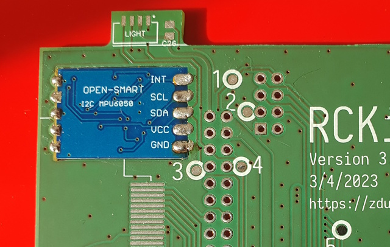

# Assembly

Please note that building _RCKid_ is likely not a beginner project. At the very least, you will need access to a soldering station and some soldering practice. If there will be any errors during the assembly, multimeter, oscilloscope and some basic electronics knowledge would be required. Some software skills, such as SSH connection and flashing is necessary as well. 

## PCB

Have the PCB printed. Simple 2 layer stackup is used with relatively large tolerances. Use either the [diptrace project](../hardware/rckid.dip) itself, or the [gerber files](../hardware/rckid.zip) that are part of this repository.

> I do recommend [aisler](https://aisler.net) if your are in Europe. 

The PCB has multiple test points that can be used to verify its functionality, while building:

- AVR Programming via UPDI : UPDI (27)
- voltage & power : VRPI (6), VRADIO (15), VUSB (16), VRGB (17), RGB_EN (18), CHARGE (19), RPI_EN (20), GND (28), VRPI_3V3 (29), VCLEAN (30)
- I2C comms: SDA (3), SCL (4)
- Radio comms: NRF_IRQ (1), NRF_RXTX (2), SPI_CE0 (21), SPI_CLK (22), SPI_MISO (23), SPI_MOSI (24)
- thumbstick: JOY_H (25), JOY_V(26)
- audio: PWM1 (9), PWM0 (10), HEADPHONES (11), MIC_OUT (12), SPKR- (13), SPKR+ (14)
- inputs: BTN_X (5), BTNS_1 (7), BTNS_2 (8)

## Instructions

1) File the pcb to ensure that all holes are proper sizes and ensure components do fit.  
2) Solder the accelerometer, components facing down, the bottom side of the accelerometer breakout should be level with the top side of RCKid's pcb. 

#### USB Power & Battery Charging

3) Solder the USB & battery power bridge (R3, D1, Q2, C27). 

> Verify VCC (via C24 & C25) via either the USB or BATT+ pins (leave the battery connector disconnected yet)

4) Solder the battery charging circuit (D2, C1, C4, IC2, R7, R2, R6). 

#### RPI & RGB Power Switches

5) Add the RPI power switch (R1, Q1)

> Verify VRPI (6) when power applied

6) Add the RGB power switch (R4, R27, Q3)

#### VCLEAN for Audio

7) Add VCLEAN LDO (L1, IC1, C2, C3)

> Check that VCLEAN (30) is 3V

#### ATTiny1616

8) Add ATTiny and its capacitors (ATTINY, C24, C25)
9) Program ATTiny bootloader & fuses via the UPDI (27)

#### 

First we are going to add the `ATTiny1616` and basic `I2C` communication to program the bootloader and verify its presence. To do so, the following must be soldered:

> TODO

When the bootloader is flashed, verify that the `I2C` communication is working by running the AVR programmer in query mode. 

## Powering Up

To power up attach the (ideally pre-charged) battery and optionally the USB-C charger as well. Upon power-on the AVR chip enters the power-on sequence